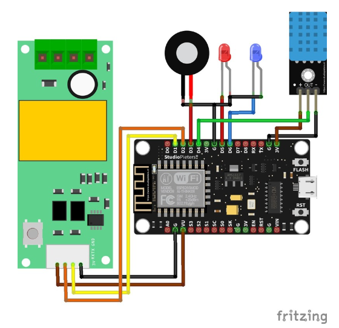

# Server Room Monitoring Based on IoT

This project is a monitoring system for temperature, humidity, and electrical parameters (voltage, current, power) for a server room or data center. The system uses **DHT11** and **PZEM-004T** sensors connected to a NodeMCU ESP8266.

Monitoring data is sent to the **Blynk IoT** platform, enabling remote monitoring via a smartphone app. Additionally, the system provides local alerts via a **Buzzer** and **LED** if parameters exceed the defined thresholds.

## Main Features

* **Temperature & Humidity Monitoring:** Detects room temperature and humidity in *real-time* using a DHT11 sensor.
* **Electrical Monitoring:** Measures voltage (V), current (A), and power (W) using the PZEM-004T sensor.
* **IoT Dashboard:** Real-time data visualization through the Blynk app.
* **Alert System:** Instant notifications via Buzzer and LED if anomalies occur (e.g., high temperature).
* **ESP8266-Based:** Uses the popular and easy-to-use NodeMCU microcontroller.

---

## Hardware Requirements

To build this project, you will need the following components:

1. **NodeMCU ESP8266:** 1 unit
2. **Temperature & Humidity Sensor:** DHT11
3. **Electrical Energy Sensor:** PZEM-004T v3.0 (includes *Current Transformer* CT)
4. **Alert Indicators:**

   * Active Buzzer
   * LED (red or any preferred color)
5. **Resistor:** 220 Ohm (for LED)
6. **Jumper Wires**

### Circuit Diagram



## Software Requirements

1. **[Arduino IDE](https://www.arduino.cc/en/software)**
2. **CP2102/CH340 Driver:** Depending on your NodeMCU type
3. **Blynk App:** Available on [Google Play Store](https://www.google.com/search?q=https://play.google.com/store/apps/details%3Fid%3Dio.blynk) and [Apple App Store](https://apps.apple.com/us/app/blynk-iot/id1559317868)
4. **Arduino Libraries:**

   * `Blynk`
   * `ESP8266WiFi`
   * `DHT`
   * `PZEM004Tv30`
   * `SimpleTimer`

---

## Setup Guide

### 1. Blynk Configuration

1. Create an account on the **Blynk** app.
2. Create a **New Project**.
3. Select **NodeMCU** as the hardware.
4. The **Auth Token** will be sent to your email. Save this token.
5. Add *widgets* to your dashboard:

   * **Gauge** for Temperature, Humidity, Voltage, Current, and Power
   * **LED** for alert status
   * Set the **Virtual Pins** for each widget according to the code

### 2. Arduino IDE Setup

1. Install Arduino IDE and set the *board* to **ESP8266**.
2. Open **Library Manager** (`Sketch` > `Include Library` > `Manage Libraries...`)
3. Search for and install all the libraries listed above.

### 3. Upload Code

1. Open the `.ino` file from this repository in Arduino IDE.

2. Modify the following lines with your credentials:

   ```cpp
   // Enter your Blynk Auth Token
   char auth[] = "YourBlynkAuthToken";

   // Enter your WiFi credentials
   char ssid[] = "YourWiFi_SSID";
   char pass[] = "YourWiFi_Password";
   ```

3. Select **"NodeMCU 1.0 (ESP-12E Module)"** as the board and the correct **Port**.

4. Click **Upload** to upload the code to the NodeMCU.

---

## How to Use

1. Ensure all components are connected according to the circuit diagram.
2. Power on the device.
3. The NodeMCU will connect to WiFi and the Blynk server.
4. Open the Blynk app on your smartphone.
5. You will see real-time temperature, humidity, and electrical data displayed on the dashboard.
6. If the temperature exceeds the threshold defined in the code, the Buzzer will sound and the LED will light up as an alert.

---
